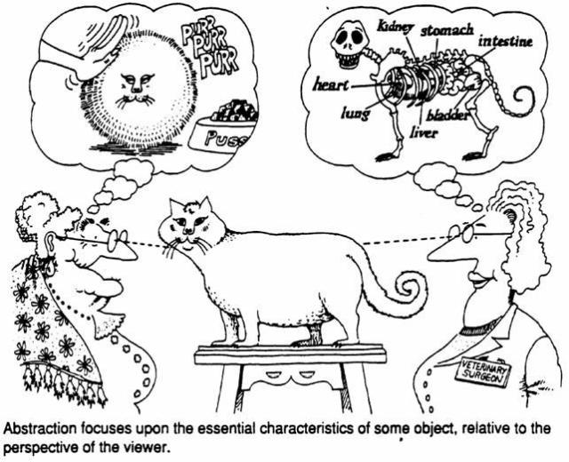

### Programação Orientada a Objetos
#### Classes, Objetos e Abstração
---

### Objetivos

Nesta aula aprenderemos a:
 - Definir uma _classe_
 - Adicionar _atributos_, _métodos_ e _construtores_ a uma classe
 - Aprender novos comandos básicos de Python
---

### Classes e Abstrações

Considere um carro:
 1. Quais são as características de um carro?
 2. Que coisas um carro pode "fazer"?
 3. Todos os carros alcançam a mesma velocidade?

 

 Foto: [Revista carro](https://revistacarro.com.br/)
---

### Programação Orientada a Objetos

Envolve implementar programas que possuem _objetos_
interagindo entre si:
- Diferentemente de programação estruturada onde
  funções/comandos interagem entre si

---

### Programação Orientada a Objetos

Qualquer coisa pode ser um objeto:
- "Coisas" do mundo real (carro, casa, avião, animal, etc.)
- Grandezas matemáticas (vetor, matriz, polinômio, etc.)
- Abstrações no contexto de um problema (gerenciador de banco de dados,
  gerenciador de conexões, fábrica de personagens, etc.)

---

### Classes

- Abstração para agrupar objetos que têm _um mesmo comportamento comum_
- Descrevem de maneira _abstrata_ o _comportamento_ dos objetos
- É uma especificação para objetos daquela classe, similar a uma planta
  baixa
---

### Classes

>> A palavra classe vem da taxonomia da biologia. Todos os seres vivos de uma
>> mesma classe biológica têm uma série de atributos e comportamentos em
>> comum, mas eles  __não são iguais__, podem variar nos valores desses atributos
>> e como realizam esses comportamentos.
---

### Objetos

- São _instâncias_ de uma classe
- _Encapsulam_ um _estado_:
    - Conjunto de valores que os _atributos_ possuem
    - Por exemplo, uma instância da classe `Carro`
      pode ter potência igual a 90, marca
      Renault, etc.

---

### Objetos

- Possuem um _comportamento_ definido através dos
  seus _métodos_
  - Têm os seus métodos chamados para executar uma ação
  no programa
  - Métodos são funções chamadas/executadas por um objeto

---

### Atributo e Estado

O estado de um objeto está definido pelos valores dos atributos de classe

Os tipos dos atributos podem ser:

 - Tipos primitivos: `int`, `float`, `double`, etc.
 - Tipos definidos pelo usuário (outras classes)
---

### Atributo e Estado
O estado está definido pelos valores dos atributos
<table>
<tr>
<td>

<td>

```cpp
Class Carro:
 // Atributos
  - marca
  - potencia
```
---

### Tipos Estruturados vs POO
Considere a classe `Circulo`:

 - Quais são as características de um círculo ?

Em C++ provavelmente definiríamos o tipo estruturado:
```cpp
struct Circulo{
    double x,y; // Coordenadas do centro
    double raio; //Raio
 };
```
---

### Tipos Estruturados vs POO
Entretanto, o tipo `Circulo` definido como _struct_:

- É utilizado apenas para armazenar dados
- Não tem um __comportamento__ definido

Para isto, existem classes!
---

### Classes em Python

Em Python, tudo é um objeto:

 ```python
>>> type(5)
< class 'int' >
>>> type("alo")
< class 'str' >
```

>> Variáveis possuem _tipos_ == objetos possuem _classes_
---

### Programação Orientada a Objetos
Programar orientado a objetos envolve:

- Identificar _classes_ que agrupam objetos com um comportamento comum
- Identificar os _atributos_ que cada objeto deve armazenar
- Identificar como os objetos devem *se comportar*
- Identificar como os objetos do sistema devem *interagir* entre si
--- 

### Programação Orientada a Objetos

>> Se eu identifiquei que classes (objetos) o meu programa
>> deve ter, como saber que atributos e métodos elas devem ter?

---

### Primeiro pilar de POO: Abstração

_Abstração:_ escolher os aspetos _mais relevantes_ para as classes/objetos
a serem implementados

 - Simplicidade: atributos irrelevantes devem ser ignorados
 - Dividir e conquistar: o propósito de uma classe deve estar bem definido
    - Implemente várias classes com propósitos diferentes, uma utilizando
      a outra, se for o caso
--- 

### Primeiro pilar de POO: Abstração



Imagem de [The Cat as a Metaphor in OO Software Development](https://effectivesoftwaredesign.com/2016/09/28/the-cat-as-a-metaphor-in-object-oriented-software-development/)
---

### Jupyter Notebook 
<a href="03-Classes-Objetos.ipynb">03-Classes-Objetos</a>
