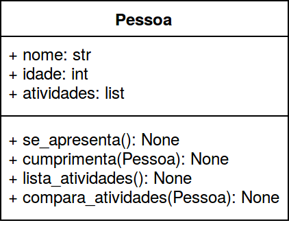
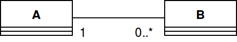
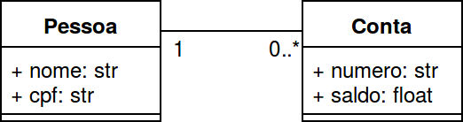
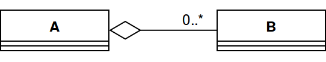
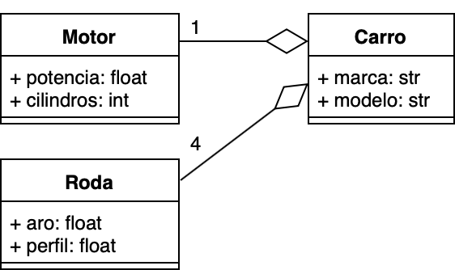
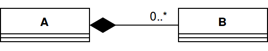
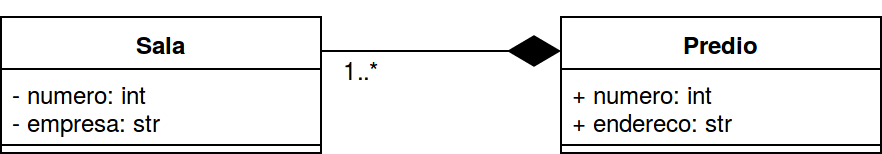

### Programação Orientada a Objetos
#### Relações entre Classes
---

### Revisão 

#### Classe
> - Abstração para agrupar objetos comuns
> - Descreve de maneira _abstrata_ o comportamento dos objetos 

#### Objetos 
> - *Instâncias* de uma classe
> - Encapsulam um _estado_
---

### Revisão
- _Construtor_/_inicializador_: inicializa (instancia) o objeto com valores iniciais para os atributos
- _Atributos_: características da entidade sendo modelada
- _Métodos_: definem o __comportamento__ através de métodos que objetos
da classe devem executar
- `self`: referência ao próprio objeto
---

### Interfaces e Encapsulamento
#### Membros privados

> - Métodos e atributos que _não devem ser visíveis_ para os usuários da classe
> - Utilizados apenas internamente, pela própria classe

#### Membros Públicos

> - Métodos que podem ser chamados _externamente_
> - Especificam um _contrato_: operações que o objeto pode realizar
---

### Interfaces e Encapsulamento

> - Alterações no estado de um objeto acontecem através da _chamada de seus métodos_
    - Atributos não devem ser modificados diretamente
      (a não ser via getters/setters)
> - As mudanças na implementação da classe não devem afetar
    os usuários da classe
---

### Aula de Hoje

> Programas do mundo real (mais complexos) são implementados
  por _várias classes_ que se _relacionam entre si_

---

### Aula de Hoje

Objetivos desta aula:

- Introduzir o conceito de diagrama de classes
- Explicar como os objetos _se relacionam_ em um sistema orientado a objetos
- Identificar os diferentes _tipos de relacionamento_ entre classes
- Implementar relações entre classes em Python

---

### Implementação de Classes

- Até então, vocês implementaram uma (ou no máximo duas) classes
  para os programas solicitados
- A partir desta aula, deverá ficar claro quando mais de uma classe
  se torna necessário e qual o papel de cada uma delas
    - Como elas se relacionam entre si

---

### Implementação de Classes

Antes disto, para facilitar:

> Como podemos mostrar/visualizar rapidamente o que possui uma classe?
---

### Diagrama de Classe UML



---

### Diagrama de Classe UML

Blocos representam classes:
- Parte superior: atributos
- Parte inferior: métodos
  - Apenas o tipo dos parâmetros e tipo de retorno
- `-` denota um atributo/método _privado_
- `+` denota um atributo/método _público_
---

### Diagrama de Classe UML

Diagrama de classe da linguagem unificada de modelagem (UML)
- Facilita a visão geral de sistemas maiores
- Ferramenta sugerida: [Draw IO](https://www.draw.io/)
  - Você pode utilizar qualquer outra
---

### Relacionamentos de Associação

- Indicam algum _relacionamento_ significativo e de interesse entre objetos
- Especificam que objetos de uma classe estão de alguma forma associados a objetos de uma outra classe
  - Pode indicar associação entre objetos de mesma classe

---

### Relacionamentos de Associação

Exemplos:
- Em um `Estacionamento` estão _estacionados_ os `Carros`
- Um `Professor` _ministra_ várias `Disciplinas`
- Uma `Mensagem` _possui_ um `Remetente` e um `Destinatário`
- Uma `Pessoa` _tem_ outra `Pessoa` como a sua mãe

---

### Relacionamentos de Associação 


Notação de _associação_ em diagrama de classes: **linha** conectando as classes que estão associadas
- Um objeto tipo A está associado com zero ou vários objetos tipo B
- Um objeto tipo B está associado com um objeto tipo A
---

### Multiplicidade:
Nas extremidades da linha denotando a associação, está a _multiplicidade_:
 - `0` : zero
 - `0..1`: zero ou um
 - `1` : um
 -  `1..*`: um ou mais
 - `0..*` ou `*`: zero ou mais
---

### Relacionamentos de Associação
#### Exemplo

Um banco, no qual cada conta bancaria está relacionada com uma pessoa (o
titular da conta):



---

### Relacionamentos de Associação
#### Exemplo

Observe que este diagrama representa uma lógica de negócio específica:
- Uma pessoa pode ter mais de uma conta? $\rightarrow$ Sim
- É possível existirem contas conjuntas? $\rightarrow$ Não

---

### Relacionamentos de Agregação

- Representa uma relação _todo-parte_ **fraca**
- __As partes podem existir sem o todo__

---

### Relacionamentos de Agregação

Exemplos:
 - Relação entre o `Carro`, as `Rodas` e o `Motor`
 - Relação entre um `Computador`,  o `Teclado`, a `Tela`

Considere que em ambos os exemplos, o objeto __todo__
pode ser instanciado sem as suas __partes__ (e vice-versa)

---

### Relacionamentos de Agregação



Em um diagrama de classes:
- A é o "todo"
  - Diamante vazado na classe "todo"
- B são as "partes"
- Linha conectando "todo" com "partes"

---

### Relacionamentos de Agregação
#### Exemplo

Um carro que possui 1 motor e 4 rodas


---

### Relacionamentos de Agregação

Com agregação:
- Objetos `Motor` e `Roda` são instanciados
- Estas instâncias são então associadas a um `Carro`
- Ou seja, `Motor`, `Roda` e `Carro` podem ser 
__instanciados independentemente__
- Se um `Carro` é removido da memória,
  o `Motor` e `Roda` a ele associados continuam a existir

---

### Relacionamentos de Composição

- Representa  uma relação _todo-parte_ **forte**
- Se o objeto _todo_ deixar de existir, os seus objetos _parte_ também devem deixar de existir

---

### Relacionamentos de Composição

Exemplos:
- Um `Estacionamento` e seus `Andares`
- Um `Prédio` e suas `Salas`
---

### Relacionamentos de Composição



Em um diagrama de classes:
juntamente com linha conectando as classes
- A é o "todo"
  - Diamante preenchido na classe "todo"
- Linha conectando "todo" com "partes"

---

### Relacionamentos de Composição
#### Exemplo

Prédio com várias salas


---

### Relacionamentos de Composição

Com composição:
- Objetos `Predio` são instanciados e,
  dentro do seu inicializador, objetos
  `Sala` também o são
- Ou seja, `Predio` instancia `Sala` automaticamente
- Não é possível instanciar `Predio` sem `Salas`
- Se um `Predio` é removido da memória,
  as `Sala` a ele associadas também são removidas

---

### Resumindo
#### Associação

- Relação genérica entre duas classes
- Nenhum objeto é considerado dono/proprietário do outro objeto

---

### Resumindo
#### Agregação

- Relação *tem um* fraca: um objeto da classe A *tem um*
  (ou mais) objeto da classe B
- Objetos da classe A podem existir objetos da classe B
    - Observe que neste caso, o objeto da classe A pode não estar pronto para uso (estado inconsistente $\rightarrow$ ele pode precisar de objetos da classe B para funcionar corretamente)
---

### Resumindo
#### Composição

- Relação *tem um* forte: um objeto da classe A *tem um*
  (ou mais) objeto da classe B
- Objetos da classe A instanciam também objetos da classe B
- Objetos da classe B deixam de existir quando objetos da classe proprietária A
deixam de existir
---

### Relações entre Objetos e Abstração

> A escolha de uma forma de relação específica
  está atrelada à abstração empregada no domínio
  do problema

---

### Relações entre Objetos e Abstração

As classes ```Motor```, ```Roda``` e ```Carro```,
por exemplo, podem ser implementadas como:

- Agregação, quando for de interesse que
  `Motor` e `Roda` sejam instanciados
  sem depender de um `Carro`
- Composição, quando for de interesse que
  `Motor` e `Roda` só sejam instanciados
  quando um `Carro` for instanciado

---

### Relações entre Classes

[06-relacoes](06-Relacoes.ipynb)

--
