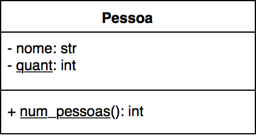

### Programação Orientada a Objetos
#### Atributos e Métodos de Classe
---

### Objetivo

Parte I - apresentar o mecanismo de herança:

- O que é herança em POO
- Como utilizá-la na linguagem Python

Parte II - apresentar atributos e métodos de classe:

- Utilidade
- Sintaxe em Python
---

### Parte I: Herança
---

### Os Quatro Pilares de POO

- Abstração
- Encapsulamento
- **Herança**: permite a reutilização de comportamento entre classes
- Polimorfismo
--- 

### Herança

- Capacidade de uma classe herdar o comportamento definido por outra classe
  - Possibilita a reutilização de código entre classes que apresentam alguma
    similaridade entre si
- Um novo tipo de relação entre classes
  - Acontece entre objetos _genéricos_ e objetos _específicos_ 
---

### UML: Herança


- Relação do tipo "_é um_": "um objeto B __é um__ objeto A"
- Classe B __herda__ o comportamento (atributos e métodos) da classe A
- A: classe base, classe mãe ou _superclasse_
- B: classe derivada, classe filha ou _subclasse_
- As superclasses devem oferecer comportamentos genéricos
- As subclasses devem oferecer comportamentos específicos
---

### Exemplos

Relações de herança entre classes:

- ```Pessoa``` e ```Aluno```: todo aluno (objeto específico) é uma pessoa
  (objeto genérico)
- ```MeioDeTransporte``` e ```Carro```: todo carro (objeto específico) é um meio de transporte
  (objeto genérico)
- ```Sensor``` e ```Sonar```: todo sonar (objeto específico) é um sensor
  (objeto genérico)
- ```Poligono``` e ```Triangulo```: todo triângulo (objeto específico) é um polígono
  (objeto genérico)
---

### Mais um exemplo

Diagrama de classe envolvendo heranças:


---

### Por que precisamos de Herança?

- As relações de herança definem uma __hierarquia de classes__ onde as subclasses
herdam as características das suas superclasses
- É útil para definir um comportamento em comum para objetos de uma mesma hierarquia
  - O código da classe base é reutilizado em todas as subclasses
  - Qualquer alteração no código da classe base é propagado para todas as subclasses
---

### Por que precisamos de Herança?

- O comportamento __comum__ a várias classes pode ser definido em uma superclasse
- Além de reutilizar código, as subclasses também podem:
  - Reescrever completamente os métodos que ditam o comportamento da classe
    (*method overriding*)
  - Estender os métodos que ditam o comportamento da classe
    (utiliza parte da implementação base)
---

### Parte II: Atributos e Métodos de Classe
---

### Atributos e Métodos de Classe

- Frequentemente, é desejável ter atributos/métodos que são "globais",
  ou seja, que não dizem respeito a uma instância específica de uma classe
- Por exemplo:
  - O endereço IP de um servidor de banco de dados
  - As possíveis `cores` de um `Carro`
  - A quantidade de instâncias criadas de uma classe
---

### Atributos e Métodos de Instância vs. Atributos e Métodos de Classe

- Até então, todos os atributos e métodos vistos são **de instância**
  - Dizem respeito a uma instância/objeto específico daquela classe
  - São comumente chamados de atributos/métodos (a parte *de instância* do nome
    *atributo de instância* é implícita)
---

### Atributos e Métodos de Instância vs. Atributos e Métodos de Classe
- Atributos e métodos de classe dizem respeito à classe, e não
  a um objeto específico daquela classe
  - Também chamados de dados *static* ou *atributos estáticos* e *métodos estáticos*
  - Não precisam de uma instância da classe para serem utilizados
- Úteis para compartilhar informações entre todos os objetos de uma mesma
  classe
---

### UML: Atributos e Métodos de Classe



Notação UML: texto sublinhado indica métodos e atributos de classe (estáticos)
---

### Atributos e Métodos de Classe

Como é em Python (mais detalhes no notebook):

```python
class A:

    # Atributos de classe são declarados fora do __init__
    atributo_de_classe1 = ...
    atributo_de_classe2 = ...
    
    def __init__(self, ...):
      # Não confundir com os atributos de instância (declarados no __init__)
      self.atributo_de_instancia1 = ...
      self.atributo_de_instancia2 = ...
      self.atributo_de_instancia3 = ...

    # Método de classe não tem parâmetro self
    def metodo_de_classe():
      ...

```
---

### Como Funciona na Prática
[09-heranca](09-Heranca.ipynb)
---