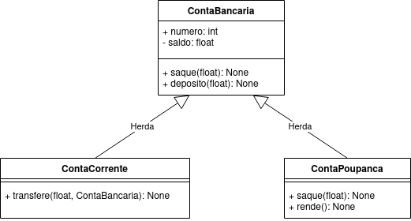
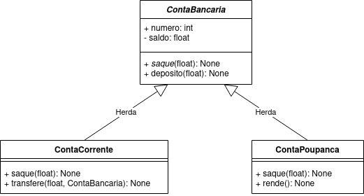

### Programação Orientada a Objetos
#### Classes Abstratas
---

### Objetivo da aula

- Apresentar o mecanismo de __classes abstratas__
 - O que são classes abstratas
 - Identificar quando utilizar classes abstratas em um projeto orientado a objetos
 - Como utilizá-las na linguagem Python
---

### Herança (revisão)

- Permite que classes derivadas _herdem o comportamento_ (atributos e métodos) de
  uma classe base
- Introduz a relação _"é um"_ (ex.: "trem" é um "meio de transporte")
- O código da superclasse é _reutilizado_ pelas classes derivadas
- As classes derivadas podem _sobrescrever_ métodos da superclasse com
  __funcionalidades específicas__
---

### Herança (revisão)

Observe um possível diagrama do sistema de contas bancárias:

- Faz sentido criar objetos tipo ``Conta``?
- Senão, qual é a utilidade dessa classe ?
---

### Classe Abstrata

- É uma classe que __não deve ser instanciada__
- Define um _comportamento comum_ para outras classes derivadas
- Toda classe que não é abstrata é chamada classe **concreta**
---

### Classe Abstrata
Classes abstratas são em geral utilizadas para:
- Oferecer código para ser reutilizado por classes derivadas
- Especificar uma interface pública a ser implementada por classes derivadas
    - Quais métodos a classe derivada deve possuir
    - Que parâmetros eles devem ter
---

### Método Abstrato

- Estão presentes __somente em classes abstratas__
- É um método _que deve ser obrigatoriamente sobrescrito_ nas classes derivadas
- Se a classe possui pelo menos um método abstrato, então ela é uma classe
  abstrata (não é possível instanciar objetos desta classe)
- Em geral, um método abstrato não possui implementação
    - Apenas especifica tipo de retorno e parâmetros
      (igual à assinatura de uma função)
    - Em Python: podem possuir implementação
---

## Classe Abstrata - UML

Na notação UML, uma classe abstrata
possui seu nome *em itálico*:

Os métodos abstratos também são indicados com fonte itálica. 

---

## Observações Importantes

- Classes concretas __não podem ter métodos abstratos__
- Se a subclasse não sobrescreve *todos* os métodos abstratos da superclasse, ela também é abstrata 
- Uma classe abstrata pode ter métodos abstratos e métodos implementados
---

## Classe Abstrata

Uso em sistemas reais:
- Prover funcionalidade comum a uma hierarquia de classes
- Extensão de programas: por exemplo, plugins

---

### Como Funciona na Prática

[10-classes-abstratas](10-Classes-Abstratas.ipynb)

---
